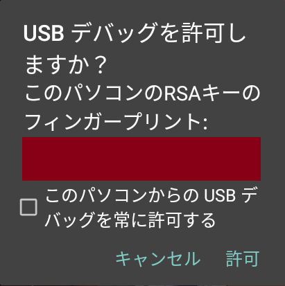
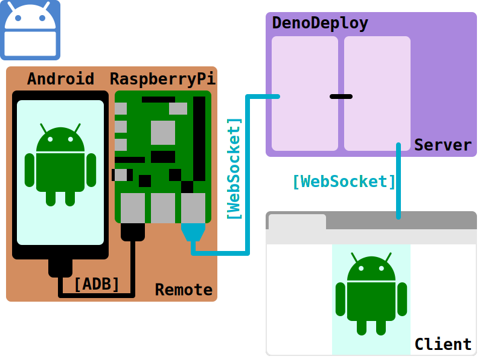

# remoid

Android remote tools.

## Need

* Android device
  * Developer mode.
* PC
  * adb
* Server
  * You can use DenoDeploy.

## How to use.

Set config.

### Env

* `REMOID_ADB`
  * default: `adb`
  * `config.json::adb`
  * ADB Path.
  * Use: Remote
* `REMOID_SERVER`
  * `config.json::url`
  * Server URL.
  * Use: Remote(required), Server
* `REMOID_AUTH_CODE`
  * `config.json::auth_code`
  * Remote <-> Server auth code.
  * Use: Remote(required), Server(required)
* `TWITTER_CALLBACK`
  * `config.json::twitter_callback`
  * Twitter callback URL.
  * Use: Server
* `TWITTER_API_KEY`
  * `config.json::twitter_api_key`
  * Twitter API Key.
  * Use: Server
* `TWITTER_API_KEY_SECRET`
  * `config.json::twitter_api_key_secret`
  * Twitter API Secret.
  * Use: Server
* `TWITTER_ENABLE_USER`
  * `config.json::twitter_user`
  * Login Twitter User id. Not Account name.
  * User id is Number.
  * Use: Server

### File

Create `./config.json`

Overwrite env config.

```json
{
  "adb": "adb path",
  "url": "http://localhost:8080/",
  "auth_code": "ABCDEFGHIJKLMNOP",
  "twitter_callback": "http://localhost:8080/auth/callback",
  "twitter_api_key": "TWITTER_API_KEY",
  "twitter_api_key_secret": "TWITTER_API_SECRET",
  "twitter_user": "TWITTER_ID(not user name.Number only.)"
}
```

Server & Remote load this config.

### Remote

* Connect Android device.
* Check `adb`
  * Raspberry Pi:
    * `apt-get install android-tools-adb android-tools-fastboot`
  * `adb devices`
  * `adb shell`
    * Allow debug.
    * 
* Start remoid.
  * `deno task remote`

### Server

Start server( `deno task main` ).

#### Deno Deploy

Set `server/server.ts` .

## Sample architecture



## Other

### Install deno in Raspberry Pi 4

```sh
curl -fsSL https://deno.land/x/install/install.sh | sh
cargo install deno --locked
```
